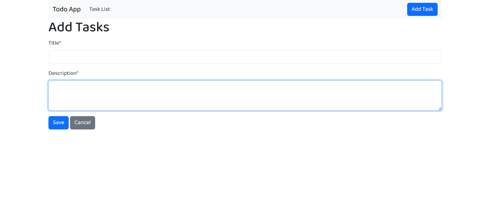
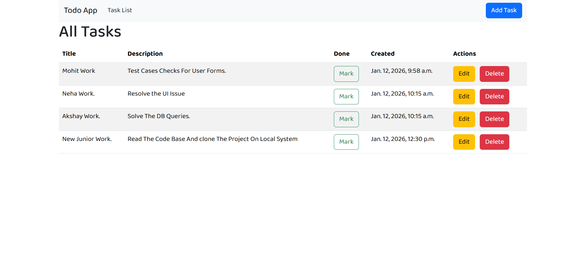
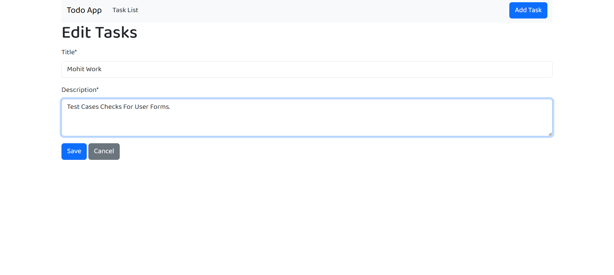
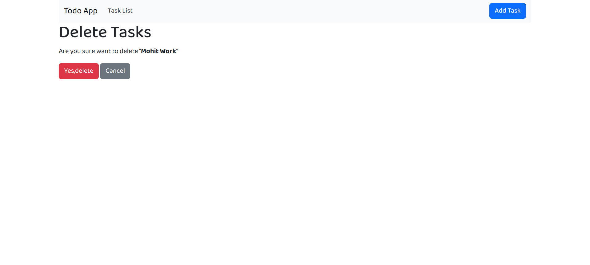

# Django Todo CRUD App

A simple **Todo application** built with **Django** using **function-based views**.  
This project implements basic **CRUD (Create, Read, Update, Delete)** functionality — allowing users to add tasks, view the task list, edit tasks, and delete tasks.

---

## 📌 Features

- Add a new task
- View all tasks
- Edit existing tasks
- Delete tasks
- Simple and clean UI

---

## 📸 Screenshots

### ➕ Add Task


### 📋 Display Task List


### ✏️ Edit Task


### 🗑️ Delete Task


---

## 🛠️ Technologies Used

| Technology | Purpose |
|------------|---------|
| Python     | Programming language |
| Django     | Web framework |
| MySQL     | database |
| HTML/CSS/Bootstrap   | Templates UI |

---

## 🚀 Getting Started

### 🔹 Prerequisites

Make sure you have the following installed:

- Python (3.8+ recommended)
- pip (Python package manager)
- (Optional) Virtual environment tool — `venv` / `virtualenv`

---

### 🛎️ Installation

1. **Clone the repository**

```bash
git clone https://github.com/omkarpawar2002/django-todo-crud.git
cd django-todo-crud
```

2. **Create and activate a virtual environment**
```
python -m venv venv
# Windows
venv\Scripts\activate
# macOS / Linux
source venv/bin/activate
```

3. **Apply migrations**
```
python manage.py migrate
```

4. **Start the development server**
```
python manage.py runserver
```

## 🧩 Usage

Once the development server is running, you can perform the following actions:

- ➕ **Add a Task** — Create a new task using the input form
- 📋 **View Task List** — See all added tasks in a list view
- ✏️ **Edit a Task** — Update an existing task
- 🗑️ **Delete a Task** — Remove a task from the list


## 🚀 Future Improvements

- 🔄 Separate tasks into **Active** and **Completed (Done)** categories
- ✅ Add task completion status (mark as done / undone)
- 📊 Improve UI for better task organization
- 🔐 Add user authentication for personal task lists

---

## 👤 Author

**Omkar Pawar**  
A Django beginner building simple and clean web applications.

- GitHub: [@omkarpawar2002](https://github.com/omkarpawar2002)
